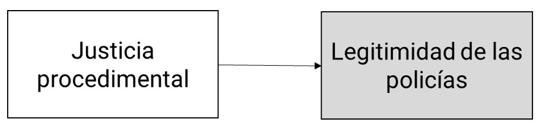
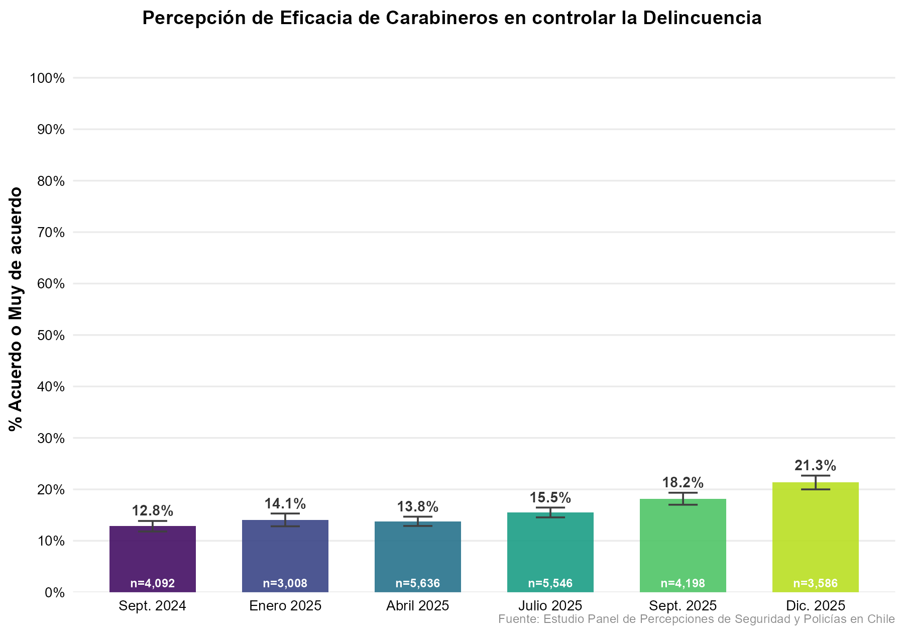
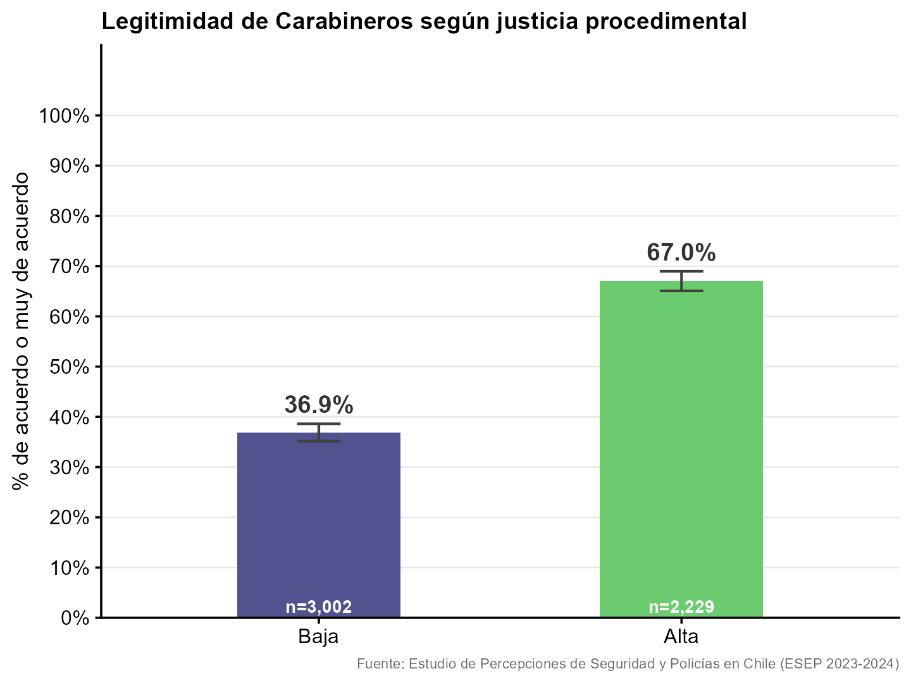
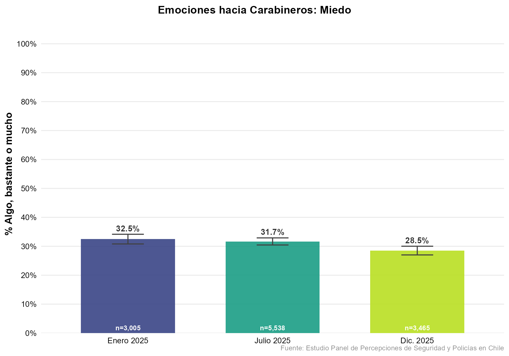
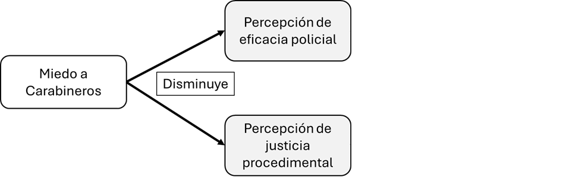
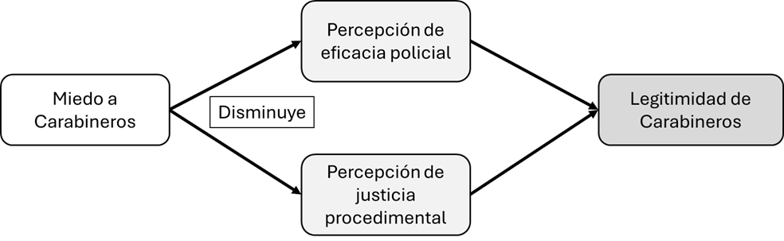
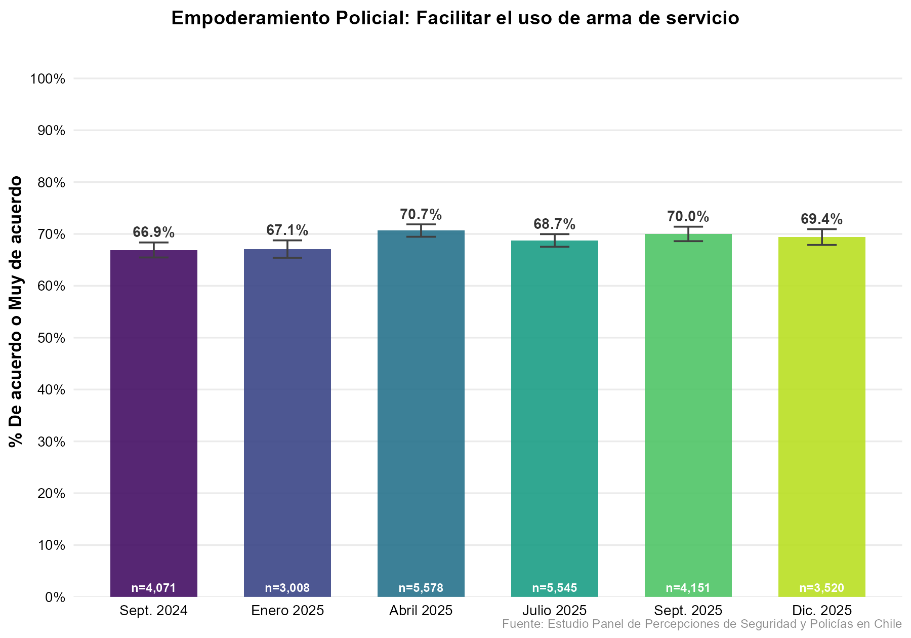
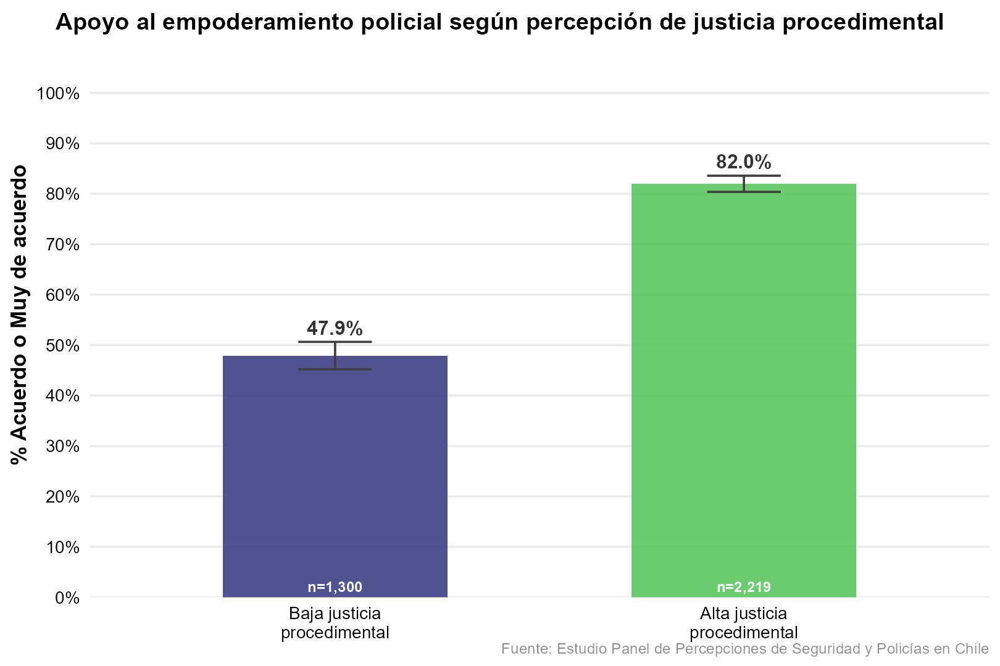
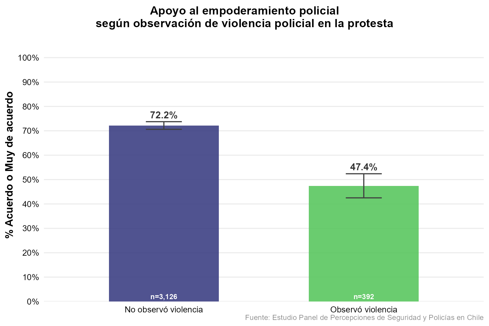

## Legitimidad Social

### ¿Qué es y por qué importa?

::::: columns
::: column
- Creencia en el derecho de las policías de ejercer su poder y dictar el comportamiento apropiado (Tyler & Jackson, 2013; Jackson, 2018)
:::

::: column
- Dos dimensiones:
  - Percepción de coincidencia entre los valores de la ciudadanía y los valores de las policías
  - Creencia de que existe la obligación de obedecer a las policías
:::
:::::

## Legitimidad Social

### ¿Qué es y por qué importa?

## Legitimidad Social

### ¿Cómo lograr legitimidad social?

{width="70%"}

## Justicia Procedimental

### ¿Qué es la Justicia Procedimental?

::::: columns
::: column
- Percepción de que las autoridades operan según procedimientos neutros y tratan a la ciudadanía de manera justa y respetuosa (Tyler & Blader, 2000)
  - Voz y participación
  - Neutralidad
:::

::: column
- Foco en las interacciones entre las policías y la ciudadanía
  - Confianza
  - Dignidad y respeto
:::
:::::

## Estudios de Percepciones de Policías y Sociedad en Chile

### Observatorio de Violencia y Legitimidad Social

- **Estudio de Percepciones de Policías y Sociedad en Chile, ESEP (2023–2024):** Encuesta cara a cara, probabilística, n = 5.304, representativa nacional (zonas urbanas, 18–65 años). Ejecutada por Datavoz Statcom. Fotografía del estado de las percepciones.

- **Estudio Panel de Percepciones de Policías y Sociedad en Chile, EPSEP (2024–2025):** Panel longitudinal online, 6 olas, sigue a las mismas personas en el tiempo. Permite observar cómo cambian las actitudes y qué factores las mueven.

- **Financiamiento:** Proyectos ANID Fondecyt Regular N.º 1221805 y Proyecto ANID Exploración N.º 13220187. FONDAP COES.

## Estudios de Percepciones de Policías y Sociedad en Chile

### Cuatro observaciones

1. **La demanda ciudadana por seguridad convive con una evaluación ambivalente de las policías: baja eficacia percibida, legitimidad y justicia procedimental altamente polarizadas**

2. [La justicia procedimental es el principal predictor de la legitimidad policial, y la legitimidad es lo que sostiene el apoyo ciudadano a Carabineros]{.grey}

3. [El miedo hacia Carabineros de Chile es un arma de doble filo: si bien puede mostrar a una fuerza policial fuerte, también disminuye las percepciones de eficacia, justicia procedimental y legitimidad]{.grey}

4. [Existe un fuerte apoyo al empoderamiento policial, pero este depende fuertemente de que Carabineros sea percibido como justo y legítimo. Entre personas que han observado violencia policial, el apoyo al empoderamiento es mucho menor]{.grey}

## ¿Logran las policías controlar la delincuencia?

### Percepción de eficacia de Carabineros de Chile

{fig-align="center" width="90%"}

## Percepción de Justicia Procedimental de Carabineros de Chile

{fig-align="center" width="90%"}

## Legitimidad de Carabineros de Chile

{fig-align="center" width="90%"}

## Estudios de Percepciones de Policías y Sociedad en Chile {.smaller}

### Cuatro observaciones

1. [La demanda ciudadana por seguridad convive con una evaluación ambivalente de las policías: baja eficacia percibida, legitimidad y justicia procedimental altamente polarizadas]{.grey}

2. **La justicia procedimental es el principal predictor de la legitimidad policial, y la legitimidad es lo que sostiene el apoyo ciudadano a Carabineros**

3. [El miedo hacia Carabineros de Chile es un arma de doble filo: si bien puede mostrar a una fuerza policial fuerte, también disminuye las percepciones de eficacia, justicia procedimental y legitimidad]{.grey}

4. [Existe un fuerte apoyo al empoderamiento policial, pero este depende fuertemente de que Carabineros sea percibido como justo y legítimo. Entre personas que han observado violencia policial, el apoyo al empoderamiento es mucho menor]{.grey}

## Justicia procedimental y legitimidad de Carabineros

{fig-align="center" width="85%"}

## Estudios de Percepciones de Policías y Sociedad en Chile {.smaller}

### Cuatro observaciones

1. [La demanda ciudadana por seguridad convive con una evaluación ambivalente de las policías: baja eficacia percibida, legitimidad y justicia procedimental altamente polarizadas]{.grey}

2. [La justicia procedimental es el principal predictor de la legitimidad policial, y la legitimidad es lo que sostiene el apoyo ciudadano a Carabineros]{.grey}

3. **El miedo hacia Carabineros de Chile es un arma de doble filo: si bien puede mostrar a una fuerza policial fuerte, también disminuye las percepciones de eficacia, justicia procedimental y legitimidad**

4. [Existe un fuerte apoyo al empoderamiento policial, pero este depende fuertemente de que Carabineros sea percibido como justo y legítimo. Entre personas que han observado violencia policial, el apoyo al empoderamiento es mucho menor]{.grey}

## Miedo a Carabineros

{fig-align="center" width="90%"}

## Miedo a Carabineros y legitimidad

{fig-align="center" width="85%"}

- El miedo a Carabineros disminuye las percepciones de eficacia y justicia procedimental de Carabineros

::: {.footnote}
Fuente: EPSEP (2024–2025)
:::

## Miedo a Carabineros y legitimidad

{fig-align="center" width="85%"}

- El miedo a Carabineros disminuye la legitimidad de Carabineros

::: {.footnote}
Fuente: EPSEP (2024–2025)
:::

## Estudios de Percepciones de Policías y Sociedad en Chile {.smaller}

### Cuatro observaciones

1. [La demanda ciudadana por seguridad convive con una evaluación ambivalente de las policías: baja eficacia percibida, legitimidad y justicia procedimental altamente polarizadas]{.grey}

2. [La justicia procedimental es el principal predictor de la legitimidad policial, y la legitimidad es lo que sostiene el apoyo ciudadano a Carabineros]{.grey}

3. [El miedo hacia Carabineros de Chile es un arma de doble filo: si bien puede mostrar a una fuerza policial fuerte, también disminuye las percepciones de eficacia, justicia procedimental y legitimidad]{.grey}

4. **Existe un fuerte apoyo al empoderamiento policial, pero este depende fuertemente de que Carabineros sea percibido como justo y legítimo. Entre personas que han observado violencia policial, el apoyo al empoderamiento es mucho menor**

## Empoderamiento policial

{fig-align="center" width="90%"}

## Empoderamiento policial y justicia procedimental

{fig-align="center" width="90%"}

## Empoderamiento policial y observación de violencia policial

{fig-align="center" width="90%"}

## Justicia procedimental, legitimidad y empoderamiento policial {.smaller}

### Conclusiones

- Importancia de la justicia procedimental y la legitimidad

- Actitudes ambivalentes en la población: llamado a aumentar la seguridad, crítica a la eficacia de Carabineros y percepciones de justicia y legitimidad polarizadas

- Empoderar a las policías sin fortalecer la justicia procedimental y los mecanismos de rendición de cuentas puede generar un empoderamiento frágil, polarizado y potencialmente contraproducente
