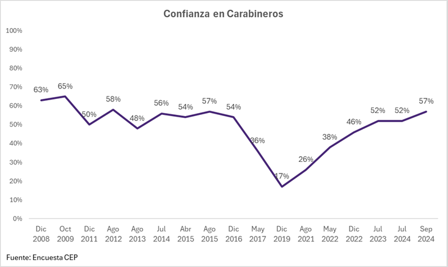
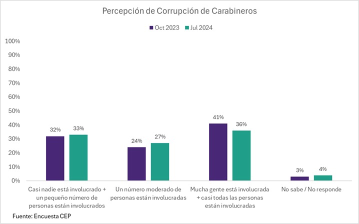
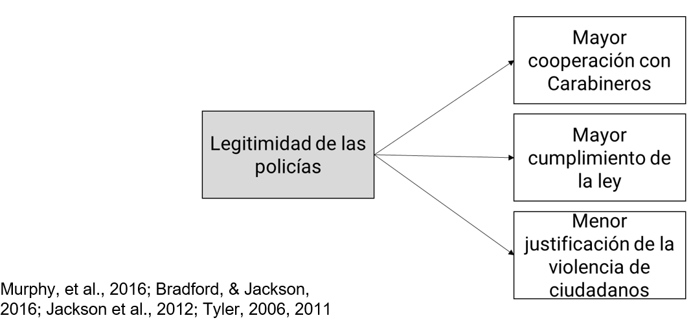
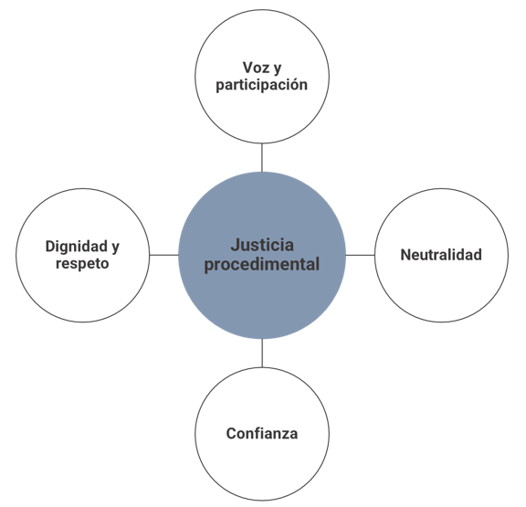
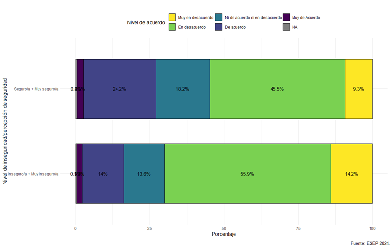

```{r setup, include=FALSE, error=TRUE}


pacman::p_load(tidyverse,
               ggplot2,
               knitr,
               kableExtra,
               haven,
               labelled,
               sjlabelled,
               ggrepel,
               mdthemes,
               readxl,
               stringr,
               wrapr,
               scales,
               janitor,
               ggpubr,
               forcats,
               gt,
               here
               )

options(digits=1)

level_likert_1 <- c(
  "Muy en desacuerdo",
  "En desacuerdo",
  "Ni de acuerdo ni en desacuerdo",
  "De acuerdo",         
  "Muy de acuerdo")

palette_likert_5 <- c(
  "#fde725",
  "#5ec962",
  "#3b528b",
  "#440154",
  "grey"
)

palette_oles_5 <- palette_likert_5

palette_oles_6 <- c(
  "#fde725",
  "#7ad151",
  "#2a788e",
  "#414487",
  "#440154",
  "grey"
  )

palette_likert_4 <-c(
  "#fde725",
  "#35b779",
  "#31688e",
  "#440154"
)

palette_oles_4 <-c(
  "#fde725",
  "#2a788e",
  "#440154",
  "grey"
)

palette_oles_3 <- c(
  "#fde725",
  "#440154",
  "grey"
)

palette_oles_2 <- c(
  "#fde725",
  "#440154"
)


#funcion demográficas sexo
plot_propbar_sexo<- function(x,fill_column,fill_palette) {
  x |>
  ggplot(aes(x = sexo, y = n, fill = !!as.name(fill_column))) +
    geom_bar(position = "fill", stat = "identity", color = "black", width = 0.6) +
    geom_text(aes(label = label), position = position_fill(vjust = 0.5), size = 3, color = "black") +
    coord_flip() +
    theme_classic() +
    theme(legend.position = "top",
          axis.title.x = element_blank(),
          axis.title.y = element_blank()) +
    labs(fill = "") +
    scale_fill_manual(values = fill_palette) +
    scale_y_continuous(labels = function(x) paste0(x * 100, "%"))+
    guides(fill = guide_legend(reverse = TRUE))
}

#función demográficas edad
plot_propbar_edad <- function(x,fill_column,fill_palette) {
  x|>
  ggplot(aes(x = edad_recod, y = n, fill = !!as.name(fill_column))) +
    geom_bar(position = "fill", stat = "identity", color = "black", width = 0.6) +
    geom_text(aes(label = label), position = position_fill(vjust = 0.5), size = 3, color = "black") +
    coord_flip() +
    theme_classic() +
    theme(legend.position = "top",
          axis.title.x = element_blank(),
          axis.title.y = element_blank()) +
    labs(fill = "") +
    scale_fill_manual(values = fill_palette) +
    scale_y_continuous(labels = function(x) paste0(x * 100, "%"))+
    guides(fill = guide_legend(reverse = TRUE))
}

#función propbar zona
plot_propbar_zona <- function(x,fill_column,fill_palette) {
  x|>
  ggplot(aes(x = zona, y = n, fill = !!as.name(fill_column))) +
    geom_bar(position = "fill", stat = "identity", color = "black", width = 0.6) +
    geom_text(aes(label = label), position = position_fill(vjust = 0.5), size = 3, color = "black") +
    coord_flip() +
    theme_classic() +
    theme(legend.position = "top",
          axis.title.x = element_blank(),
          axis.title.y = element_blank()) +
    labs(fill = "") +
    scale_fill_manual(values = fill_palette) +
    scale_y_continuous(labels = function(x) paste0(x * 100, "%"))+
    guides(fill = guide_legend(reverse = TRUE))
}

#función propbar gse
plot_propbar_gse <- function(x,fill_column,fill_palette) {
  x|>
  ggplot(aes(x = gse_recod, y = n, fill = !!as.name(fill_column))) +
    geom_bar(position = "fill", stat = "identity", color = "black", width = 0.6) +
    geom_text(aes(label = label), position = position_fill(vjust = 0.5), size = 3, color = "black") +
    coord_flip() +
    theme_classic() +
    theme(legend.position = "top",
          axis.title.x = element_blank(),
          axis.title.y = element_blank()) +
    labs(fill = "") +
    scale_fill_manual(values = fill_palette) +
    scale_y_continuous(labels = function(x) paste0(x * 100, "%"))+
    guides(fill = guide_legend(reverse = TRUE))
}

#función base descriptivos
proc_plot_demo <- function(x, variable, demografico) {
  x %>%
    mutate({{ variable }} := to_label({{ variable }})) %>%
    group_by({{ demografico }}) %>%
    count({{ variable }}) %>%
    mutate(prop = round(n / sum(n) * 100, 0),
           ola = "(2024)",
           label=ifelse(prop>3,paste0(prop,"%"),NA))
}


data_ola0 <- readRDS(here::here("esep_w0.rds")) |>
  janitor::clean_names()|>
   rename(
         edad=edad_encuestado
         )|>
   mutate(edad_recod=case_when(edad <= 25 ~ "25 años o menos",
                              edad > 25 & edad <= 40 ~ "Entre 26 y 40 años",
                              edad > 40 & edad <= 60 ~ "Entre 41 y 60 años",
                              edad > 60 ~ "Más de 60 años"),
          region=paste0(toupper(substr(region, 1, 1)),tolower(substr(region, 2, nchar(region)))),
          zona=case_when(
            region%in%c("Arica y parinacota","Tarapacá","Antofagasta")~"Norte Grande",
            region%in%c("Coquimbo","Atacama")~"Norte Chico",
            region=="Metropolitana"~"Región Metropolitina",
            region%in%c("Valparaíso","Libertador bernardo o’higgins",
                        "Maule","Ñuble")~"Zona Central",
            region%in%c("Biobío","Araucanía","Los lagos","Los ríos")~"Zona Sur",
            region%in%c("Aysén","Magallanes")~"Zona Austral"
          ),
          zona=factor(zona,levels = c("Norte Grande",
                                      "Norte Chico",
                                      "Región Metropolitina",
                                      "Zona Central",
                                      "Zona Sur",
                                      "Zona Austral")),
          gse_recod=case_when(
            gse%in%c(6,5)~"Bajo",
            gse%in%c(4,3)~"Medio",
            gse%in%c(2,1)~"Alto",
            gse==7~"Sin Info."
          ),
          sexo=to_label(sexo)
        ) 
```

## Legitimidad Social

<center>{width="70%"}</center>

------------------------------------------------------------------------

## Legitimidad Social

<center>{width="70%"}</center>

------------------------------------------------------------------------

### Legitimidad Social

#### ¿Qué es y por qué importa?

::::: columns
::: column
-   Creencia en el derecho de las policías de ejercer su poder y dictar el comportamiento apropiado (Tyler & Jackson, 2013; Jackson, 2018)
:::

::: column
-   Percepción de coincidencia entre los valores de la ciudadanía y los valores de las policías
-   Creencia de que existe la obligación de obedecer a las policías
:::
:::::

------------------------------------------------------------------------

### Legitimidad Social

#### ¿Qué es y por qué importa?

<center></center>

------------------------------------------------------------------------

### Legitimidad Social

#### ¿Cómo lograr legitimidad social?

<center>{width="70%"}</center>

------------------------------------------------------------------------

### ¿Qué es la Justicia Procedimental?

::::: columns
::: column
-   Percepción de que las autoridades operan según procedimientos neutros y tratan a la ciudadanía de manera justa y respetuosa (Tyler & Blader, 2000)
:::

::: column
-   Foco en las interacciones entre las policías y la ciudadanía
:::
:::::

------------------------------------------------------------------------

### ¿Qué es la Justicia Procedimental?

<center></center>

------------------------------------------------------------------------

## Ficha técnica del Estudio {.smaller}

```{r}
readxl::read_xlsx(path = here::here('ficha_tecnica_w0.xlsx'), 
                         sheet = 'w0') |>
  
  kbl(booktabs = TRUE) |>
    kable_styling(latex_options = c("repeat_header","hold_position"),
                bootstrap_options = "bordered",full_width = T,
                font_size=18) |>
  kable_classic_2()
```

# Percepción de seguridad {.r-fit-text background-image="img/oles_delincuencia.jpg"}

------------------------------------------------------------------------

#### Pensando en la delincuencia, usted diría que durante los últimos 12 meses la delincuencia en el país...

```{r}
val_label(data_ola0$b1,99)<-"NS-NR"
val_label(data_ola0$b1,88)<-"NS-NR"

data_ola0 |>
    mutate(
    b1=to_label(b1)
    )|>
  count(b1) |>
  mutate(prop=(n/nrow(data_ola0)*100)|>round(1),
         ola="(2024)"
         )|>

  ggplot(aes(x=ola,y=prop,color=b1))+
  
  geom_point()+
  geom_line()+
  geom_text_repel(aes(label = paste0(prop,"%")))+
  mdthemes::md_theme_classic() +
  scale_y_continuous(labels = function(x) paste0(x, "%"),limits = c(0,100))+
  theme(
    legend.position = c(.95, .95),
    legend.justification = c("right", "top"),
    legend.box.just = "right",
    legend.margin = margin(6, 6, 6, 6),
    axis.title.x = element_blank(),
    axis.title.y = element_blank()
    )+
  labs(
    caption = "Fuente: ESEP 2024.",
    color="Respuesta"
  )+
  scale_color_manual(values = c(
  "#440154",
  "#2a788e",
  "#fde725",
  "grey"
  )
)
```

------------------------------------------------------------------------

#### Pensando en la delincuencia, usted diría que durante los últimos 12 meses la delincuencia en el país...

```{r}
ggarrange(

data_ola0 |> 
  proc_plot_demo(b1,sexo)|>
  mutate(b1=factor(b1,
                   levels=c("Disminuyó",
                            "Se mantuvo",
                            "Aumentó",
                            "NS-NR"))) |>
  plot_propbar_sexo(fill_column="b1",fill_palette=palette_oles_4),


data_ola0 |> 
  proc_plot_demo(b1,edad_recod)|>
  mutate(b1=factor(b1,
                   levels=c("Disminuyó",
                            "Se mantuvo",
                            "Aumentó",
                            "NS-NR"))) |>
  plot_propbar_edad(fill_column = "b1",fill_palette = palette_oles_4),

data_ola0 |>
  proc_plot_demo(b1,zona)|>
  mutate(b1=factor(b1,
                   levels=c("Disminuyó",
                            "Se mantuvo",
                            "Aumentó",
                            "NS-NR"))) |> 
  plot_propbar_zona(fill_column = "b1",fill_palette = palette_oles_4),

 data_ola0 |>
  proc_plot_demo(b1,gse_recod)|>
  mutate(b1=factor(b1,
                   levels=c("Disminuyó",
                            "Se mantuvo",
                            "Aumentó",
                            "NS-NR"))) |>
  plot_propbar_gse(fill_column = "b1",fill_palette = palette_oles_4),

ncol = 2, nrow = 2, align = "hv", 
          common.legend = TRUE
 
)|>
  annotate_figure(bottom=text_grob("Fuente: ESEP 2024.",hjust = 1,x=1,size = 10))


```

------------------------------------------------------------------------

#### ¿Qué tan seguro/a se siente caminando solo/a por su barrio cuando ya está oscuro?

```{r}
val_label(data_ola0$b2,99)<-"NS-NR"
val_label(data_ola0$b2,88)<-"NS-NR"

data_ola0 |>
  mutate(b2=to_label(b2),
         b2=dplyr::recode(b2,"Muy inseguro/a" = "Inseguro/a + Muy inseguro/a",
                             "Inseguro/a" = "Inseguro/a + Muy inseguro/a",
                             "Seguro/a" = "Seguro/a + Muy seguro/a",
                             "Muy seguro/a" = "Seguro/a + Muy seguro/a")) |>
  count(b2) |> 
  mutate(prop=(n/nrow(data_ola0)*100)|>round(1),
         ola="(2024)") |>
  filter(b2!="No sabe (No leer)") |>
  filter(b2!="No responde (No leer)") |>

ggplot(aes(x=ola,y=prop,color=b2))+
  geom_point()+
  geom_line()+
  geom_text_repel(aes(label = paste0(prop,"%")))+
  scale_y_continuous(labels = function(x) paste0(x, "%"),limits = c(0,100))+
  mdthemes::md_theme_classic() +
  theme(
    legend.position = c(.95, .70),
    legend.justification = c("right", "top"),
    legend.box.just = "right",
    legend.margin = margin(6, 6, 6, 6),
    axis.title.x = element_blank(),
    axis.title.y = element_blank(),
    legend.key.size = unit(0.5, "lines"),
    legend.key.width = unit(0.5, "lines")
    )+
  labs(
    caption = "Fuente: ESEP 2024.",
    color="Respuesta"
  ) +
  scale_color_manual(values = palette_oles_3)
```

------------------------------------------------------------------------

#### ¿Qué tan seguro/a se siente caminando solo/a por su barrio cuando ya está oscuro?

```{r}
ggarrange(

data_ola0 |> 
  proc_plot_demo(b2,sexo)|>
  mutate(b2=factor(b2,
                   levels=c("Muy inseguro/a",
                            "Inseguro/a",
                            "Seguro/a",
                            "Muy seguro/a",
                            "NS-NR"))) |>
  plot_propbar_sexo(fill_column="b2",fill_palette=palette_oles_5),


data_ola0 |> 
  proc_plot_demo(b2,edad_recod)|>
  mutate(b2=factor(b2,
                   levels=c("Muy inseguro/a",
                            "Inseguro/a",
                            "Seguro/a",
                            "Muy seguro/a",
                            "NS-NR"))) |>
  plot_propbar_edad(fill_column = "b2",fill_palette = palette_oles_5),

data_ola0 |>
  proc_plot_demo(b2,zona)|>
  mutate(b2=factor(b2,
                   levels=c("Muy inseguro/a",
                            "Inseguro/a",
                            "Seguro/a",
                            "Muy seguro/a",
                            "NS-NR"))) |> 
  plot_propbar_zona(fill_column = "b2",fill_palette = palette_oles_5),

 data_ola0 |>
  proc_plot_demo(b2,gse_recod)|>
  mutate(b2=factor(b2,
                   levels=c("Muy inseguro/a",
                            "Inseguro/a",
                            "Seguro/a",
                            "Muy seguro/a",
                            "NS-NR"))) |>
  plot_propbar_gse(fill_column = "b2",fill_palette = palette_oles_5),

ncol = 2, nrow = 2, align = "hv", 
          common.legend = TRUE
)|>
  annotate_figure(bottom=text_grob("Fuente: ESEP 2024.",hjust = 1,x=1,size = 10))
```

# Eficacia de las policías {.r-fit-text background-image="img/oles_carabineros.webp"}

------------------------------------------------------------------------

#### Carabineros logra controlar el problema de la delincuencia en Chile {.smaller}

```{r}

val_label(data_ola0$c1_1,99)<-"NS-NR"
val_label(data_ola0$c1_1,88)<-"NS-NR"

data_ola0 |>
  mutate(c1_1=to_label(c1_1))|>
  count(Variable=c1_1)|>
  mutate(prop=(n/nrow(data_ola0)*100)|>round(1),
         Item="Carabineros logra controlar el problema de la delincuencia en Chile")|>
  
  ggplot(aes(x=Variable,y=prop,fill=Variable))+
  geom_bar(position="dodge", stat="identity",color="black") +
  geom_text(aes(label=paste0(prop,"%")),
            hjust=-0.1) +
  md_theme_classic() +
  theme(legend.position="top",
        axis.title.x = element_blank(),
        axis.title.y = element_blank())+
  scale_y_continuous(labels = function(x) paste0(x, "%"),limits = c(0,100))+
  scale_fill_manual(values = palette_oles_6)+
  coord_flip() +
  guides(fill=FALSE)+
  labs(caption = "[Proporción de casos perdidos = 0.30%]")


```

------------------------------------------------------------------------

#### Carabineros logra controlar el problema de la delincuencia en Chile {.smaller}

```{r}

ggarrange(

data_ola0 |> 
  proc_plot_demo(c1_1, sexo) |>
  mutate(c1_1 = factor(c1_1,
                     levels = c(
                                "Muy en desacuerdo",
                                "En desacuerdo",
                                "Ni de acuerdo ni en desacuerdo",
                                "De acuerdo",
                                "Muy de Acuerdo",
                                "NS-NR"))) |>
  plot_propbar_sexo(fill_column = "c1_1", fill_palette = palette_oles_6),


data_ola0 |> 
  proc_plot_demo(c1_1, edad_recod) |>
  mutate(c1_1 = factor(c1_1,
                     levels = c(
                                "Muy en desacuerdo",
                                "En desacuerdo",
                                "Ni de acuerdo ni en desacuerdo",
                                "De acuerdo",
                                "Muy de Acuerdo",
                                "NS-NR"))) |>
  plot_propbar_edad(fill_column = "c1_1", fill_palette = palette_oles_6),

data_ola0 |>
  proc_plot_demo(c1_1, zona) |>
  mutate(c1_1 = factor(c1_1,
                     levels = c(
                                "Muy en desacuerdo",
                                "En desacuerdo",
                                "Ni de acuerdo ni en desacuerdo",
                                "De acuerdo",
                                "Muy de Acuerdo",
                                "NS-NR"))) |> 
  plot_propbar_zona(fill_column = "c1_1", fill_palette = palette_oles_6),

 data_ola0 |>
  proc_plot_demo(c1_1, gse_recod) |>
  mutate(c1_1 = factor(c1_1,
                     levels = c(
                                "Muy en desacuerdo",
                                "En desacuerdo",
                                "Ni de acuerdo ni en desacuerdo",
                                "De acuerdo",
                                "Muy de Acuerdo",
                                "NS-NR"))) |>
  plot_propbar_gse(fill_column = "c1_1", fill_palette = palette_oles_6),

ncol = 2, nrow = 2, align = "hv", 
common.legend = TRUE
)|>
  annotate_figure(bottom=text_grob("Fuente: ESEP 2024.",hjust = 1,x=1,size = 10))


```

------------------------------------------------------------------------

#### Carabineros logra controlar el problema de la delincuencia en Chile según miedo a la delincuencia {.smaller}



------------------------------------------------------------------------

#### Carabineros logra controlar el problema del narcotráfico en Chile {.smaller}

```{r}
val_label(data_ola0$c1_2,99)<-"NS-NR"
val_label(data_ola0$c1_2,88)<-"NS-NR"

data_ola0 |>
  count(Variable=to_label(c1_2))|>
  mutate(prop=(n/nrow(data_ola0)*100)|>round(1),
         Item="Carabineros logra controlar el problema del narcotráfico en Chile")|>
  mutate(Item=str_wrap(Item, width = 60)) |>

  ggplot(aes(x=Variable,y=prop,fill=Variable))+
  geom_bar(position="dodge", stat="identity",color="black") +
  geom_text(aes(label=paste0(prop,"%")),
            hjust=-0.1) +
  md_theme_classic() +
  theme(legend.position="top",
        axis.title.x = element_blank(),
        axis.title.y = element_blank())+
  scale_y_continuous(labels = function(x) paste0(x, "%"),limits = c(0,100))+
  scale_fill_manual(values = palette_oles_6)+
  coord_flip() +
  guides(fill=FALSE)+
  labs(caption = "[Proporción de casos perdidos = 0.60%]")


```

------------------------------------------------------------------------

#### Carabineros logra controlar el problema del narcotráfico en Chile {.smaller}

```{r}
ggarrange(

data_ola0 |> 
  proc_plot_demo(c1_2, sexo) |>
  mutate(c1_2 = factor(c1_2,
                     levels = c("Muy en desacuerdo",
                                "En desacuerdo",
                                "Ni de acuerdo ni en desacuerdo",
                                "De acuerdo",
                                "Muy de Acuerdo",
                                "NS-NR"))) |>
  plot_propbar_sexo(fill_column = "c1_2", fill_palette = palette_oles_6),


data_ola0 |> 
  proc_plot_demo(c1_2, edad_recod) |>
  mutate(c1_2 = factor(c1_2,
                     levels = c("Muy en desacuerdo",
                                "En desacuerdo",
                                "Ni de acuerdo ni en desacuerdo",
                                "De acuerdo",
                                "Muy de Acuerdo",
                                "NS-NR"))) |>
  plot_propbar_edad(fill_column = "c1_2", fill_palette = palette_oles_6),

data_ola0 |>
  proc_plot_demo(c1_2, zona) |>
  mutate(c1_2 = factor(c1_2,
                     levels = c("Muy en desacuerdo",
                                "En desacuerdo",
                                "Ni de acuerdo ni en desacuerdo",
                                "De acuerdo",
                                "Muy de Acuerdo",
                                "NS-NR"))) |> 
  plot_propbar_zona(fill_column = "c1_2", fill_palette = palette_oles_6),

 data_ola0 |>
  proc_plot_demo(c1_2, gse_recod) |>
  mutate(c1_2 = factor(c1_2,
                     levels = c("Muy en desacuerdo",
                                "En desacuerdo",
                                "Ni de acuerdo ni en desacuerdo",
                                "De acuerdo",
                                "Muy de Acuerdo",
                                "NS-NR"))) |>
  plot_propbar_gse(fill_column = "c1_2", fill_palette = palette_oles_6),

ncol = 2, nrow = 2, align = "hv", 
common.legend = TRUE
)|>
  annotate_figure(bottom=text_grob("Fuente: ESEP 2024.",hjust = 1,x=1,size = 10))


```

# Legitimidad de Carabineros {.r-fit-text background-image="img/oles_carabineros.webp"}

------------------------------------------------------------------------

#### En general, los carabineros tienen la misma idea que yo sobre lo que está bien y lo que está mal {.smaller}

```{r}
val_label(data_ola0$c1_3,99)<-"NS-NR"
val_label(data_ola0$c1_3,88)<-"NS-NR"

data_ola0 |>
  count(Variable=to_label(c1_3))|>
  mutate(prop=(n/nrow(data_ola0)*100)|>round(1),
         Item="En general, los carabineros tienen la misma idea que yo sobre lo que está bien y lo que está mal")|>
  mutate(Item=str_wrap(Item, width = 60)) |>

  ggplot(aes(x=Variable,y=prop,fill=Variable))+
  geom_bar(position="dodge", stat="identity",color="black") +
  geom_text(aes(label=paste0(prop,"%")),
            hjust=-0.1) +
  md_theme_classic() +
  theme(legend.position="top",
        axis.title.x = element_blank(),
        axis.title.y = element_blank())+
  scale_y_continuous(labels = function(x) paste0(x, "%"),limits = c(0,100))+
  coord_flip() +
  scale_fill_manual(values = palette_oles_6)+
  guides(fill=FALSE)+
  labs(caption = "[Proporción de casos perdidos = 1.90%]")


```

------------------------------------------------------------------------

#### En general, los carabineros tienen la misma idea que yo sobre lo que está bien y lo que está mal {.smaller}

```{r}
ggarrange(

data_ola0 |> 
  proc_plot_demo(c1_3, sexo) |>
  mutate(c1_3 = factor(c1_3,
                     levels = c("Muy en desacuerdo",
                                "En desacuerdo",
                                "Ni de acuerdo ni en desacuerdo",
                                "De acuerdo",
                                "Muy de Acuerdo",
                                "NS-NR"))) |>
  plot_propbar_sexo(fill_column = "c1_3", fill_palette = palette_oles_6),


data_ola0 |> 
  proc_plot_demo(c1_3, edad_recod) |>
  mutate(c1_3 = factor(c1_3,
                     levels = c("Muy en desacuerdo",
                                "En desacuerdo",
                                "Ni de acuerdo ni en desacuerdo",
                                "De acuerdo",
                                "Muy de Acuerdo",
                                "NS-NR"))) |>
  plot_propbar_edad(fill_column = "c1_3", fill_palette = palette_oles_6),

data_ola0 |>
  proc_plot_demo(c1_3, zona) |>
  mutate(c1_3 = factor(c1_3,
                     levels = c("Muy en desacuerdo",
                                "En desacuerdo",
                                "Ni de acuerdo ni en desacuerdo",
                                "De acuerdo",
                                "Muy de Acuerdo",
                                "NS-NR"))) |> 
  plot_propbar_zona(fill_column = "c1_3", fill_palette = palette_oles_6),

 data_ola0 |>
  proc_plot_demo(c1_3, gse_recod) |>
  mutate(c1_3 = factor(c1_3,
                     levels = c("Muy en desacuerdo",
                                "En desacuerdo",
                                "Ni de acuerdo ni en desacuerdo",
                                "De acuerdo",
                                "Muy de Acuerdo",
                                "NS-NR"))) |>
  plot_propbar_gse(fill_column = "c1_3", fill_palette = palette_oles_6),

ncol = 2, nrow = 2, align = "hv", 
common.legend = TRUE
)|>
  annotate_figure(bottom=text_grob("Fuente: ESEP 2024.",hjust = 1,x=1,size = 10))


```

------------------------------------------------------------------------

#### Hay que respetar las decisiones que toman los carabineros, aunque no se esté de acuerdo con ellas {.smaller}

```{r}

data_ola0 <- data_ola0 %>%
  mutate(c1_4 = if_else(is.na(c1_4), 99, c1_4))

val_label(data_ola0$c1_4,99)<-"NS-NR"
val_label(data_ola0$c1_4,88)<-"NS-NR"

# Falta arreglar la introducción de NA
data_ola0 |>
  count(Variable=to_label(c1_4))|>
  group_by(Variable)|>
  summarise(n=sum(n))|>
  ungroup()|>
  mutate(prop=(n/nrow(data_ola0)*100)|>round(1),
         Item="Hay que respetar las decisiones que toman los carabineros, aunque no se esté de acuerdo con ellas")|>
  mutate(Item=str_wrap(Item, width = 60)) |>

  ggplot(aes(x=Variable,y=prop,fill=Variable))+
  geom_bar(position="dodge", stat="identity",color="black") +
  geom_text(aes(label=paste0(prop,"%")),
            hjust=-0.1) +
  md_theme_classic() +
  theme(legend.position="top",
        axis.title.x = element_blank(),
        axis.title.y = element_blank())+
  scale_y_continuous(labels = function(x) paste0(x, "%"),limits = c(0,100))+
  coord_flip() +
  scale_fill_manual(values = palette_oles_6)+
  guides(fill=FALSE)+
  labs(caption = "[Proporción de casos perdidos = 0.30%]")

```

------------------------------------------------------------------------

#### Hay que respetar las decisiones que toman los carabineros, aunque no se esté de acuerdo con ellas {.smaller}

```{r}
ggarrange(

data_ola0 |> 
  proc_plot_demo(c1_4, sexo) |>
  mutate(c1_4 = factor(c1_4,
                     levels = c("Muy en desacuerdo",
                                "En desacuerdo",
                                "Ni de acuerdo ni en desacuerdo",
                                "De acuerdo",
                                "Muy de Acuerdo",
                                "NS-NR"))) |>
  plot_propbar_sexo(fill_column = "c1_4", fill_palette = palette_oles_6),


data_ola0 |> 
  proc_plot_demo(c1_4, edad_recod) |>
  mutate(c1_4 = factor(c1_4,
                     levels = c("Muy en desacuerdo",
                                "En desacuerdo",
                                "Ni de acuerdo ni en desacuerdo",
                                "De acuerdo",
                                "Muy de Acuerdo",
                                "NS-NR"))) |>
  plot_propbar_edad(fill_column = "c1_4", fill_palette = palette_oles_6),

data_ola0 |>
  proc_plot_demo(c1_4, zona) |>
  mutate(c1_4 = factor(c1_4,
                     levels = c("Muy en desacuerdo",
                                "En desacuerdo",
                                "Ni de acuerdo ni en desacuerdo",
                                "De acuerdo",
                                "Muy de Acuerdo",
                                "NS-NR"))) |> 
  plot_propbar_zona(fill_column = "c1_4", fill_palette = palette_oles_6),

 data_ola0 |>
  proc_plot_demo(c1_4, gse_recod) |>
  mutate(c1_4 = factor(c1_4,
                     levels = c("Muy en desacuerdo",
                                "En desacuerdo",
                                "Ni de acuerdo ni en desacuerdo",
                                "De acuerdo",
                                "Muy de Acuerdo",
                                "NS-NR"))) |>
  plot_propbar_gse(fill_column = "c1_4", fill_palette = palette_oles_6),

ncol = 2, nrow = 2, align = "hv", 
common.legend = TRUE
)|>
  annotate_figure(bottom=text_grob("Fuente: ESEP 2024.",hjust = 1,x=1,size = 10))

```

# Justicia procedimental de las policías {.r-fit-text background-image="img/oles_carabineros.webp"}

------------------------------------------------------------------------

#### Los carabineros toman decisiones justas e imparciales en los casos que se ocupa {.smaller}

```{r}
val_label(data_ola0$c2_1,99)<-"NS-NR"
val_label(data_ola0$c2_1,88)<-"NS-NR"

data_ola0 |>
  count(Variable=to_label(c2_1))|>
  mutate(prop=(n/nrow(data_ola0)*100)|>round(2),
         Item="tratan a las personas con respeto en Chile")|>
  mutate(Variable=factor(Variable,levels=c(
    "Nunca",
    "Pocas veces",
    "Algunas veces",
    "Casi siempre",
    "Siempre",
    "NS-NR"
  )))|>

  ggplot(aes(x=Variable,y=prop,fill=Variable))+
  geom_bar(position="dodge", stat="identity",color="black") +
  mdthemes::md_theme_classic() +
  theme(legend.position="top",
        axis.title.x = element_blank(),
        axis.title.y = element_blank())+
  scale_y_continuous(labels = function(x) paste0(x, "%"),limits = c(0,100))+
  geom_text(aes(label=paste0(prop,"%"),vjust=-0.2)) +
  scale_fill_manual(values = palette_oles_6)+
  guides(fill=FALSE)

```

------------------------------------------------------------------------

#### Los carabineros toman decisiones justas e imparciales en los casos que se ocupa {.smaller}

```{r}
ggarrange(

data_ola0 |> 
  proc_plot_demo(c2_1, sexo) |>
  mutate(c2_1 = factor(c2_1,
                     levels = c(
    "Nunca",
    "Pocas veces",
    "Algunas veces",
    "Casi siempre",
    "Siempre",
    "NS-NR"))) |>
  plot_propbar_sexo(fill_column = "c2_1", fill_palette = palette_oles_6),


data_ola0 |> 
  proc_plot_demo(c2_1, edad_recod) |>
  mutate(c2_1 = factor(c2_1,
                     levels = c(
    "Nunca",
    "Pocas veces",
    "Algunas veces",
    "Casi siempre",
    "Siempre",
    "NS-NR"
                     ))) |>
  plot_propbar_edad(fill_column = "c2_1", fill_palette = palette_oles_6),

data_ola0 |>
  proc_plot_demo(c2_1, zona) |>
  mutate(c2_1 = factor(c2_1,
                     levels = c("Nunca",
    "Pocas veces",
    "Algunas veces",
    "Casi siempre",
    "Siempre",
    "NS-NR"))) |> 
  plot_propbar_zona(fill_column = "c2_1", fill_palette = palette_oles_6),

 data_ola0 |>
  proc_plot_demo(c2_1, gse_recod) |>
  mutate(c2_1 = factor(c2_1,
                     levels = c("Nunca",
    "Pocas veces",
    "Algunas veces",
    "Casi siempre",
    "Siempre",
    "NS-NR"))) |>
  plot_propbar_gse(fill_column = "c2_1", fill_palette = palette_oles_6),

ncol = 2, nrow = 2, align = "hv", 
common.legend = TRUE
)|>
  annotate_figure(bottom=text_grob("Fuente: ESEP 2024.",hjust = 1,x=1,size = 10))


```

------------------------------------------------------------------------

#### Los carabineros tratan a las personas con respeto en Chile {.smaller}

```{r}
val_label(data_ola0$c2_2,99)<-"NS-NR"
val_label(data_ola0$c2_2,88)<-"NS-NR"


data_ola0 |>
  count(Variable=to_label(c2_2)) |>
  mutate(prop=(n/nrow(data_ola0)*100)|>round(2),
         Item="Toman decisiones justas e imparciales en los casos que se ocupa?") |>
    mutate(Variable=factor(Variable,levels=c(
    "Nunca",
    "Pocas veces",
    "Algunas veces",
    "Casi siempre",
    "Siempre",
    "NS-NR"
  )))|>
  
  ggplot(aes(x=Variable,y=prop,fill=Variable))+
  geom_bar(position="dodge", stat="identity",color="black") +
  mdthemes::md_theme_classic() +
  theme(legend.position="top",
        axis.title.x = element_blank(),
        axis.title.y = element_blank())+
  scale_y_continuous(labels = function(x) paste0(x, "%"),limits = c(0,100))+
  geom_text(aes(label=paste0(prop,"%"),vjust=-0.2)) +
  scale_fill_manual(values = palette_oles_6)+
  guides(fill=FALSE)
```

------------------------------------------------------------------------

#### Los carabineros tratan a las personas con respeto en Chile {.smaller}

```{r}
ggarrange(

data_ola0 |> 
  proc_plot_demo(c2_2, sexo) |>
  mutate(c2_2 = factor(c2_2,
                     levels = c(
    "Nunca",
    "Pocas veces",
    "Algunas veces",
    "Casi siempre",
    "Siempre",
    "NS-NR"))) |>
  plot_propbar_sexo(fill_column = "c2_2", fill_palette = palette_oles_6),


data_ola0 |> 
  proc_plot_demo(c2_2, edad_recod) |>
  mutate(c2_2 = factor(c2_2,
                     levels = c(
    "Nunca",
    "Pocas veces",
    "Algunas veces",
    "Casi siempre",
    "Siempre",
    "NS-NR"
                     ))) |>
  plot_propbar_edad(fill_column = "c2_2", fill_palette = palette_oles_6),

data_ola0 |>
  proc_plot_demo(c2_2, zona) |>
  mutate(c2_2 = factor(c2_2,
                     levels = c("Nunca",
    "Pocas veces",
    "Algunas veces",
    "Casi siempre",
    "Siempre",
    "NS-NR"))) |> 
  plot_propbar_zona(fill_column = "c2_2", fill_palette = palette_oles_6),

 data_ola0 |>
  proc_plot_demo(c2_2, gse_recod) |>
  mutate(c2_2 = factor(c2_2,
                     levels = c("Nunca",
    "Pocas veces",
    "Algunas veces",
    "Casi siempre",
    "Siempre",
    "NS-NR"))) |>
  plot_propbar_gse(fill_column = "c2_2", fill_palette = palette_oles_6),

ncol = 2, nrow = 2, align = "hv", 
common.legend = TRUE
)|>
  annotate_figure(bottom=text_grob("Fuente: ESEP 2024.",hjust = 1,x=1,size = 10))
```

# Empoderamiento de las policías {.r-fit-text background-image="img/oles_carabineros.webp"}

------------------------------------------------------------------------

#### Empoderamiento de las policías

-   “La disposición del público para otorgar a las fuerzas del orden una mayor capacidad, autoridad y apoyo público en el desempeño de sus funciones.”

    -   **Capacidades**: recursos y habilidades (personal, equipamiento, formación, recursos tecnológicos).
    -   **Autoridad**: poder legal, administración propia de justicia, mayor margen de discreción, autonomía, baja rendición de cuentas, uso de la fuerza y armas de fuego.
    -   **Apoyo público**: legitimidad pública, percepción de justicia procedimental.eater authority to ensure public safety, or does such empowerment risk undermining compliance with human rights protections?

(Bradford et al., 2020; Fox et al., 2020; Metcalfe & Hoge, 2018; Pryce, 2019; Sargeant et al., 2024; Sunshine & Tyler, 2003; Yesberg et al., 2023; Yesberg & Bradford, 2018)

------------------------------------------------------------------------

#### Endurecer las penas contra quienes atenten contra la integridad física de Carabineros {.smaller}

```{r}
val_label(data_ola0$c7_1,99)<-"NS-NR"
val_label(data_ola0$c7_1,88)<-"NS-NR"

data_ola0 |>
  count(Variable=to_label(c7_1)) |>
  mutate(prop=(n/nrow(data_ola0)*100)|>round(2)) |>
  
  ggplot(aes(x=Variable,y=prop,fill=Variable))+
  geom_bar(position="dodge", stat="identity",color="black") +
  mdthemes::md_theme_classic() +
  theme(legend.position="top",
        axis.title.x = element_blank(),
        axis.title.y = element_blank())+
  scale_y_continuous(labels = function(x) paste0(x, "%"),limits = c(0,100))+
  scale_fill_manual(values = palette_oles_6)+
  geom_text(aes(label=paste0(prop,"%"),hjust=-0.2)) +
  guides(fill=FALSE)+
  coord_flip()+
  labs(caption="Fuente: ESEP 2024")

```

------------------------------------------------------------------------

#### Endurecer las penas contra quienes atenten contra la integridad física de Carabineros {.smaller}

```{r}
ggarrange(

data_ola0 |> 
  proc_plot_demo(c7_1, sexo) |>
  mutate(c7_1 = factor(c7_1,
                     levels = c("Muy en desacuerdo",
                                "En desacuerdo",
                                "Ni de acuerdo ni en desacuerdo",
                                "De acuerdo",
                                "Muy de Acuerdo",
                                "NS-NR"))) |>
  plot_propbar_sexo(fill_column = "c7_1", fill_palette = palette_oles_6),


data_ola0 |> 
  proc_plot_demo(c7_1, edad_recod) |>
  mutate(c7_1 = factor(c7_1,
                     levels = c("Muy en desacuerdo",
                                "En desacuerdo",
                                "Ni de acuerdo ni en desacuerdo",
                                "De acuerdo",
                                "Muy de Acuerdo",
                                "NS-NR"))) |>
  plot_propbar_edad(fill_column = "c7_1", fill_palette = palette_oles_6),

data_ola0 |>
  proc_plot_demo(c7_1, zona) |>
  mutate(c7_1 = factor(c7_1,
                     levels = c("Muy en desacuerdo",
                                "En desacuerdo",
                                "Ni de acuerdo ni en desacuerdo",
                                "De acuerdo",
                                "Muy de Acuerdo",
                                "NS-NR"))) |> 
  plot_propbar_zona(fill_column = "c7_1", fill_palette = palette_oles_6),

 data_ola0 |>
  proc_plot_demo(c7_1, gse_recod) |>
  mutate(c7_1 = factor(c7_1,
                     levels = c("Muy en desacuerdo",
                                "En desacuerdo",
                                "Ni de acuerdo ni en desacuerdo",
                                "De acuerdo",
                                "Muy de Acuerdo",
                                "NS-NR"))) |>
  plot_propbar_gse(fill_column = "c7_1", fill_palette = palette_oles_6),

ncol = 2, nrow = 2, align = "hv", 
common.legend = TRUE
)|>
  annotate_figure(bottom=text_grob("Fuente: ESEP 2024.",hjust = 1,x=1,size = 10))


```

------------------------------------------------------------------------

#### Dar mayores facilidades para que los carabineros puedan usar su arma de servicio cuando lo estimen necesario {.smaller}

```{r}
val_label(data_ola0$c7_2,99)<-"NS-NR"
val_label(data_ola0$c7_2,88)<-"NS-NR"


data_ola0 |>
  count(Variable=to_label(c7_2)) |>
  mutate(prop=(n/nrow(data_ola0)*100)|>round(2))|>
  
  ggplot(aes(x=Variable,y=prop,fill=Variable))+
  geom_bar(position="dodge", stat="identity",color="black") +
  mdthemes::md_theme_classic() +
  theme(legend.position="top",
        axis.title.x = element_blank(),
        axis.title.y = element_blank())+
  scale_y_continuous(labels = function(x) paste0(x, "%"),limits = c(0,100))+
  scale_fill_manual(values = palette_oles_6)+
  geom_text(aes(label=paste0(prop,"%"),hjust=-0.2)) +
  guides(fill=FALSE)+
  coord_flip()+
  labs(caption="Fuente: ESEP 2024")
```

------------------------------------------------------------------------

#### Dar mayores facilidades para que los carabineros puedan usar su arma de servicio cuando lo estimen necesario {.smaller}

```{r}
ggarrange(

data_ola0 |> 
  proc_plot_demo(c7_2, sexo) |>
  mutate(c7_2 = factor(c7_2,
                     levels = c("Muy en desacuerdo",
                                "En desacuerdo",
                                "Ni de acuerdo ni en desacuerdo",
                                "De acuerdo",
                                "Muy de Acuerdo",
                                "NS-NR"))) |>
  plot_propbar_sexo(fill_column = "c7_2", fill_palette = palette_oles_6),


data_ola0 |> 
  proc_plot_demo(c7_2, edad_recod) |>
  mutate(c7_2 = factor(c7_2,
                     levels = c("Muy en desacuerdo",
                                "En desacuerdo",
                                "Ni de acuerdo ni en desacuerdo",
                                "De acuerdo",
                                "Muy de Acuerdo",
                                "NS-NR"))) |>
  plot_propbar_edad(fill_column = "c7_2", fill_palette = palette_oles_6),

data_ola0 |>
  proc_plot_demo(c7_2, zona) |>
  mutate(c7_2 = factor(c7_2,
                     levels = c("Muy en desacuerdo",
                                "En desacuerdo",
                                "Ni de acuerdo ni en desacuerdo",
                                "De acuerdo",
                                "Muy de Acuerdo",
                                "NS-NR"))) |> 
  plot_propbar_zona(fill_column = "c7_2", fill_palette = palette_oles_6),

 data_ola0 |>
  proc_plot_demo(c7_2, gse_recod) |>
  mutate(c7_2 = factor(c7_2,
                     levels = c("Muy en desacuerdo",
                                "En desacuerdo",
                                "Ni de acuerdo ni en desacuerdo",
                                "De acuerdo",
                                "Muy de Acuerdo",
                                "NS-NR"))) |>
  plot_propbar_gse(fill_column = "c7_2", fill_palette = palette_oles_6),

ncol = 2, nrow = 2, align = "hv", 
common.legend = TRUE
)|>
  annotate_figure(bottom=text_grob("Fuente: ESEP 2024.",hjust = 1,x=1,size = 10))


```

------------------------------------------------------------------------

#### Reflexiones

-   Legitimidad de Carabineros ha recuperado sus altos niveles

-   Sin embargo, existe una baja percepción de eficacia de Carabineros en su labor

    -   Rol del miedo a la delincuencia

-   Aún hay espacio para crecer en percepciones de legitimidad y buen trato
